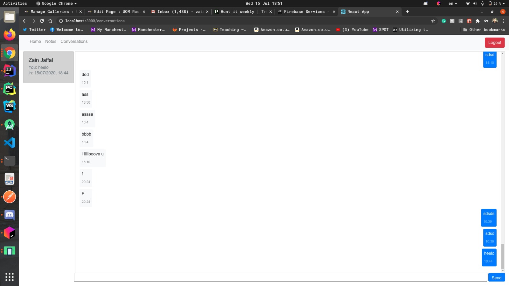

# Golf Job

## About the Project
client management software for a golf trainer, The application supports clients creating accounts and chatting with their assigned trainer. The application is equipped with
an admin panel to see the current clients. Leave notes for them with a video feedback, or char with the users.

## Backend
The backend was implemented using NodeJs and express library to send HTTP requests for the front-end

## Front end
Build using React and Bootstrap for styling.

## Screenshots
### Login Page

### Chatting

